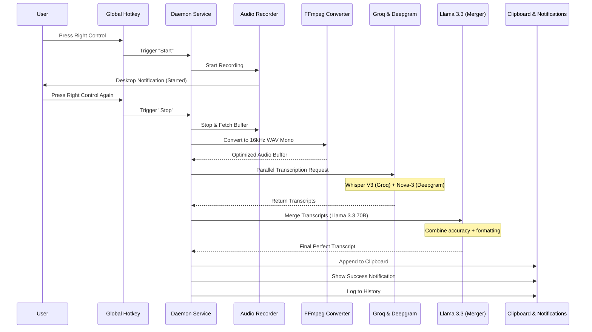

# Transcription Data Flow (STT Flow)

This document details the complete path from a user's voice input to the final text in their clipboard. `voice-cli` optimizes for speed, accuracy, and reliability by using a multi-service parallel approach combined with an LLM-based merger.

## Flow Diagram

## Step-by-Step Breakdown

### 1. Trigger (Global Hotkey)
- **Library**: `node-global-key-listener`.
- **Key**: Default is `Right Control`.
- **Behavior**: Toggle mode. The first press starts the recording; the second press stops it.
- **Verification**: Checks for hotkey conflicts at startup.

### 2. Audio Capture
- **Utility**: `arecord` (via `node-record-lpcm16`).
- **Configuration**:
  - Sample Rate: 16,000 Hz
  - Channels: 1 (Mono)
  - Format: WAV (LPCM 16-bit)
- **Safety Limits**:
  - **Min Duration**: 0.6 seconds (rejects accidental triggers).
  - **Max Duration**: 5 minutes (auto-stops to prevent runaway resource usage).
  - **Warning**: Desktop notifications at 4:00 and 4:30 minutes.
  - **Silence Detection**: Warns the user if the recorded audio contains no detectable speech (RMS threshold).

### 3. Pre-processing
- **Utility**: `ffmpeg`.
- **Purpose**: Normalizes the audio buffer to ensure strict compatibility with external APIs.
- **Specs**: 16kHz, Mono, PCM 16-bit Little Endian.

### 4. Parallel Transcription
To minimize latency and maximize accuracy, `voice-cli` executes requests to two separate providers simultaneously using `Promise.all`:

1.  **Groq (Whisper Large V3)**:
    - **Strength**: Unrivaled technical accuracy and word recognition.
    - **Usage**: Primary source for content.
2.  **Deepgram (Nova-3)**:
    - **Strength**: Exceptional punctuation, capitalization, and formatting.
    - **Usage**: Primary source for structure.

**Fallback Logic**: If one service fails, the daemon automatically uses the result from the successful one. If both fail, a critical error notification is shown.

### 5. LLM-Based Merging
If both Groq and Deepgram return results, they are sent to **Llama 3.3 70B** on Groq Cloud.

- **Prompting**: The LLM is instructed to trust Groq for words/technical terms and Deepgram for punctuation/formatting.
- **Deduplication**: Automatically removes hallucinations or repeated phrases common in Whisper models.
- **Latency**: Highly optimized (typically <500ms).
- **Fallback**: If the LLM call fails or times out, the system defaults to the Deepgram result (for better formatting) or Groq.

### 6. Output Generation
The final text follows three paths:

1.  **Clipboard (Critical)**:
    - **Action**: **APPEND** to current clipboard history.
    - **Wayland**: Uses `wl-copy`.
    - **X11**: Uses `clipboardy`.
    - **Resilience**: Never overwrites user's existing clipboard content.
2.  **Notification**:
    - **Action**: Desktop notification via `libnotify` (`notify-send`).
    - **Content**: Summary of success or detailed error message.
3.  **History**:
    - **Location**: `~/.config/voice-cli/history.json`.
    - **Metadata**: Stores timestamp, text, duration, engine used, and processing time.

## Performance Metrics
- **Avg. Time to Clipboard**: 1.2s - 2.5s (depending on audio length).
- **Audio processing overhead**: <100ms.
- **LLM Merging overhead**: 300ms - 600ms.
